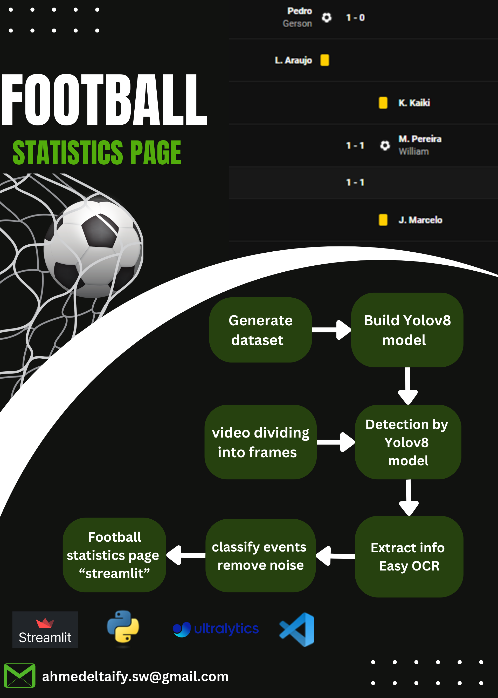

# Football Statistics Page

## Overview

The Football Statistics Page project is designed to extract and present key match statistics such as goals, cards, and substitutions using YOLOv8 and OCR.

## Getting Started

### 1. Download Matches

- Download the matches from the file `matches.txt`.
- Place the downloaded match videos in the appropriate directory. The file `matches.txt` contains links or references to the football match videos that will be processed.

### 2. Cut Events

- Cut specific events from the match videos, such as goals, yellow cards, red cards, and substitutions.
- Use a video editor or an automated script to segment these events from the match videos.

### 3. Generate Dataset

- Run the `generate_DS.py` script for each type of event. This script processes the segmented event videos and generates a dataset suitable for training a YOLO model.

### 4. Train YOLO Model in Colab

- Once the dataset is created, you can train the YOLO model using the provided Colab notebook. Upload the dataset to your Colab environment and run the generate-yolo-model.ipynb notebook.

### 5. Obtain the Model Detection File

- After training, the model detection file best.pt will be generated. This file contains the trained YOLO model and can be used for object detection in your main code.
  
## Techniques Used:

- **YOLOv8**: Used for real-time object detection to identify events and elements such as yellow/red cards, goals, and substitutions from
video frames.
.
- **EasyOCR**: to read text information displayed on the screen, such as scoreboard data and player statistics..
- **StreamLit**:  representation of statistics of the match.

